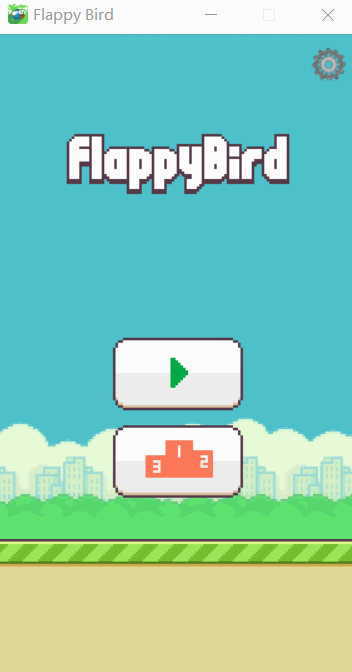
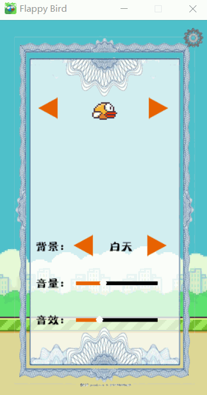
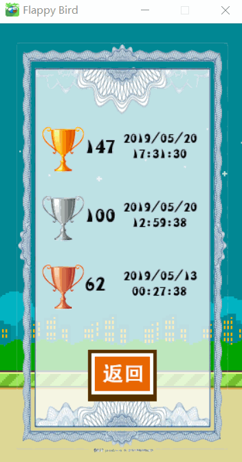
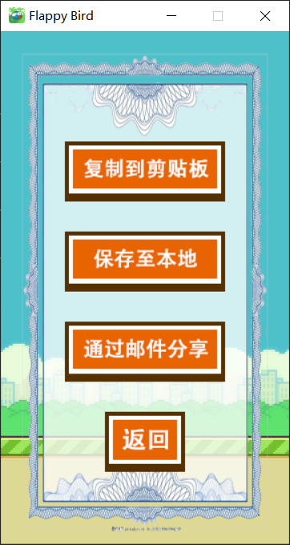
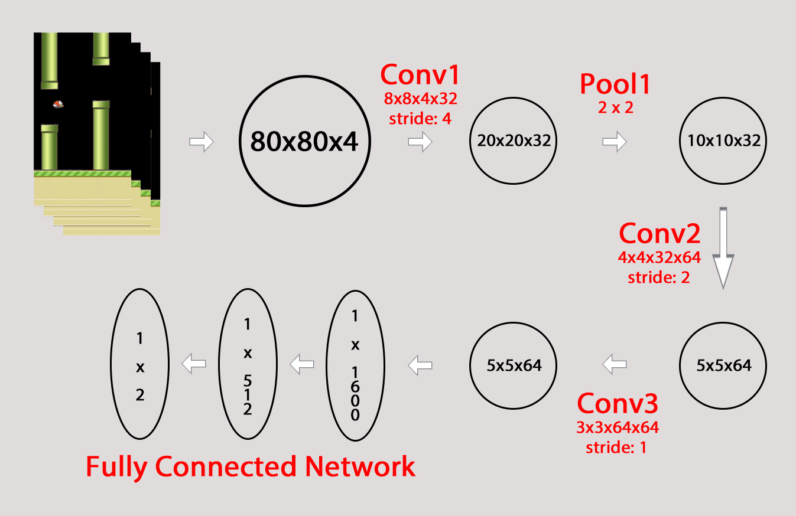

# Flappy Bird

## <span id="overview">Overview</span>
* [Installation Dependencies](#dependencies)
* [Game](#game)
* [Reinforcement Learning](#rl)(强化学习)

## <span id="dependencies">[Installation Dependencies](#overview)</span>
* python ~= 3.7
* pygame ~= 1.9.6
* tensorflow ~= 1.13
* opencv ~= 3.4.2
* numpy ~= 1.14.5
* sqlite ~= 3.27.2
* pillow ~= 6.0.0
* pywin32 ~= 223

## <span id="game">[Game](#overview)</span>

### How to Play?
```bash
git clone https://github.com/yanyongyu/FlappyBird.git
cd FlappyBird
python main.py
```
using <font color=#ee77ff>space</font>/<font color=#00ff7f>key-up</font>/<font color=#ff7f00>mouse-left</font> to make the bird fly

using <font color=#ee77ff>escape</font>/<font color=#00ff7f>key-p</font> or click the pause button to pause the game

### shortcuts
* <font size=4>homepage</font>
  
  <br>
* <font size=4>setting</font>
  
  <br>
* <font size=4>rank</font>
  
  <br>
* <font size=4>game</font>
  
  <br>
* <font size=4>share</font>
  

## <span id="rl">[Deep Q Network](#overview)</span>

### What is Deep Q Network?
It is a convolutional neural network, trained with a variant of Q-learning, whose input is raw pixels and whose output is a value function estimating future rewards.

### Experiments

#### Environment
Since deep Q-network is trained on the raw pixel values observed from the game screen at each time step, Kevin Chen finds that remove the background appeared in the original game can make it converge faster. This process can be visualized as the following figure:


#### Network Architecture


### How to Train?
```bash
python dqn.py
```
