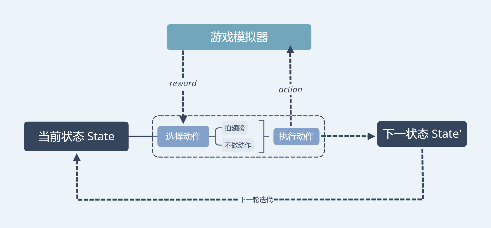
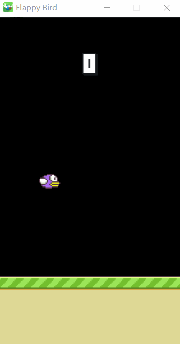
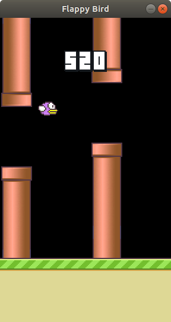
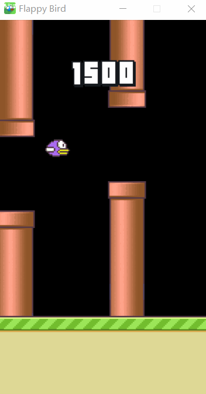

# Flappy Bird

## <span id="overview">Overview</span>

- [Installation Dependencies](#dependencies)
- [Game](#game)
- [RL DQN](#rl)(强化学习)
- [Improve](#improve)

## <span id="dependencies">[Installation Dependencies](#overview)</span>

- python ~= 3.7
- pygame ~= 1.9.6
- tensorflow ~= 1.13
- opencv ~= 3.4.2
- numpy ~= 1.14.5
- sqlite ~= 3.27.2
- pillow ~= 6.0.0
- pywin32 ~= 223 [Optional]

You can use the following code to install my environment by pip:

```bash
pip install -r requirements.txt
```

If you are using conda, you may use the following code to create a new environment:

```bash
conda install --yes --file requirements.txt
```

## <span id="game">[Game](#overview)</span>

### How to Play?

```bash
git clone https://github.com/yanyongyu/FlappyBird.git
cd FlappyBird
python main.py
```

using <font color=#ee77ff>space</font>/<font color=#00ff7f>key-up</font>/<font color=#ff7f00>mouse-left</font> to make the bird fly

using <font color=#ee77ff>escape</font>/<font color=#00ff7f>key-p</font> or click the pause button to pause the game

### shortcuts

- <font size=4>homepage</font>

  

- <font size=4>setting</font>

  

- <font size=4>rank</font>

  

- <font size=4>game</font>

  

- <font size=4>share</font>

  

## <span id="rl">[Deep Q Network](#overview)</span>

### What is Deep Q Network?

It is a convolutional neural network, trained with a variant of Q-learning, whose input is raw pixels and whose output is a value function estimating future rewards.



### Experiments

#### Environment

Since deep Q-network is trained on the raw pixel values observed from the game screen at each time step, Kevin Chen finds that remove the background appeared in the original game can make it converge faster. This process can be visualized as the following figure:


#### Network Architecture


### How to Train?

```bash
python dqn.py
```

Model will be saved in ./dqn_model/

Log file will be saved in ./dqn_logs/

Use following code to see the graph and loss:

```bash
tensorboard --logdir dqn_logs
```

### Process

#### 0 Step



#### 300w Step



### Result

After about 300w step, the bird has a good performance.The score can easily reach 100.

## <span id="improve">Improve</span>

It's enough? No!

### Double DQN

Change the network into two parts: target_net and eval_net.

- use eval network to select what is the best action to take for the next state (the action with the highest Q value).
- use target network to calculate the target Q value of taking that action at the next state.

The model can converge much faster. At about 175w step, the score has a dramatic growth.


